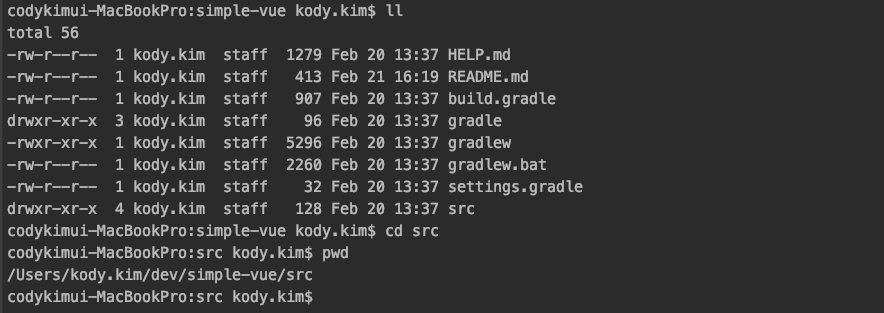

# SpringBoot + gradle + vue 환경 구성

SpringBoot은 resources/static 경로에 정적 리소스를 관리한다. 

gradle에 node plugin을 사용하여 빌드시에 생성된 리소스를 resources/static 경로에 배포하여 사용가능 하도록 설정함.

## 1. 사전준비

* node & npm 설치
* [vue cli](https://cli.vuejs.org/) 설치 
* spring boot + gradle 프로젝트 생성

## 2. vue cli로 프로젝트 생성

### 2.1 src 경로로 이동



### 2.2 vue 프로젝트 생성

vue cli를 사용하여 default로 vue 프로젝트 구성

```text
vue create frontend
```


### 2.3 .gitignore 설정

* vue cli 로 생성된 프로젝트에 .gitignore를 제거.
* 프로젝트 최상위에 .gitignore에 아래 설정을 추가.

```text
...

### Node ###
node_modules/**
**/node_modules/**
dist/
**/dist/**
**/package-lock.json
```

### 2.4 vue.config.js 추가

* proxy 서버 설정 추가
  * 로컬에서 개발시 vue와 spring을 각각 실행 후 proxy 설정을 사용하여 개발해야 함.

* path 를 사용하여 빌드 후 리소스 파일 배포 경로 지정

> path 설치
```text
npm install path
```

```javascript 1.5
const path = require('path')

module.exports = {
    // path 설정
    outputDir: path.resolve(__dirname, "../main/resources/static/vue"),
    
    // proxy 설정
    devServer: {
        proxy: {
            '/' : {
                target: 'http://localhost:9000',
                ws: true,
                changeOrigin: true
            }
        }
    }
}
```

## 3. springboot port 변경

application.properties에서 port 변경

```properties
server.port=9000
```

## 4. gradle 설정

### 4.1 node plugin 추가

```groovy
plugins {
    ...
    id 'com.moowork.node' version '1.3.1'
    ...
}
```

### 4.2 node 설정 추

```groovy
// Node 설정
node {
	version = '13.6.0'
	npmVersion = '6.13.1'
	download = false
	workDir = file("./src/frontend")
	nodeModulesDir = file("./src/frontend")
}

// npmInstall 실행 Config
npmInstall {
	args = ['install']
	inputs.files file('package.json')
	outputs.files file('node_modules')
}

task vueBuild(type: NpmTask, dependsOn: npmInstall){
	description = "Build vue.js"
	args = ['run','build']
}

processResources.dependsOn 'vueBuild'
```